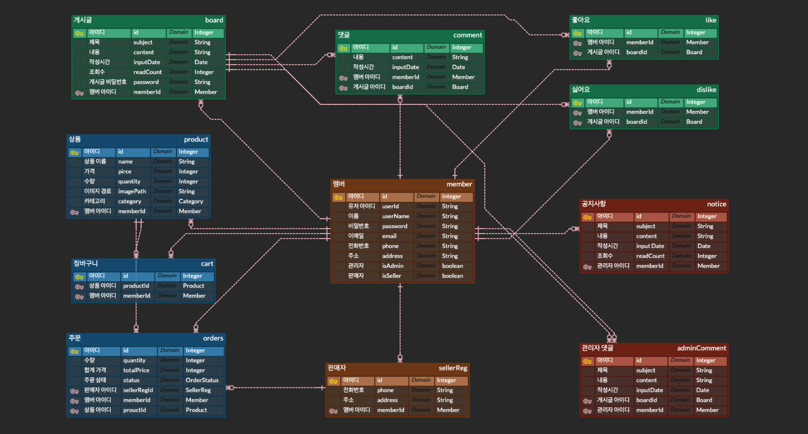

# eCommerce Mall
## 온라인 쇼핑 플랫폼
- spring으로 만들어 본 온라인 쇼핑 웹사이트 프로젝트 (캡스톤 디자인)
- 배포 : [Ecmall 웹사이트](https://ecmall.site)

## 설계
### 유스케이스 다이어그램

### 시스템 구성 다이어그램

### ERD

## 주요기능

### Unlogin User
- 게시글 조회, 검색, 정렬 순서 선택
- 조회 수, 좋아요, 싫어요 조회
- 상품 조회, 카테고리 별 조회

### Login User
- 회원가입, 로그인
  - 회원가입 시, 아이디 중복 확인 및 이메일 등록
  - 이름과 이메일을 확인 후, 아이디 찾기 
  - 아이디, 이름, 이메일 확인 후, 비밀번호 찾기 
  - 비밀번호 변경
  - 회원 정보 조회 및 수정
  - 로그아웃과 회원 탈퇴
- 게시판
  - 게시글 조회, 검색, 정렬 순서 선택
  - 조회 수, 좋아요, 싫어요 조회
  - 게시글 작성, 수정, 삭제
  - 댓글 작성, 수정, 삭제
- 쇼핑몰
  - 판매자
    - 판매자 등록
      - 관리자 승인이 완료되면 쇼핑몰에 상품 등록 가능
    - 상품 조회, 등록, 수정, 삭제 
    - 등록한 상품 주문현황 조회
    - 주문 상태 변경
      - 주문접수, 배송준비, 배송시작, 환불
  - 소비자
    - 상품 조회, 카테고리 별 조회
    - 장바구니 담기
    - 주문 상태 변경
      - 주문 접수 전 취소, 물품 수령, 환불 요청
    
    
### Admin
- 회원관리
  - 모든 판매자 조회
  - 판매자 등록 대기 조회
  - 판매자 등록 승인
  - 판매자 권환 회수
- 공지사항 
  - 공지사항 작성, 수정, 삭제
- 로그인 회원의 모든 기능
  - 게시글에 관리자 답글 작성, 수정, 삭제

## 사용된 기술
- Java 17
- SpringBoot 3.0.2
- Spring MVC
- Spring DataJPA
- Thymeleaf
- Gradle
- Amazon EC2
- MariaDB
- Nginx